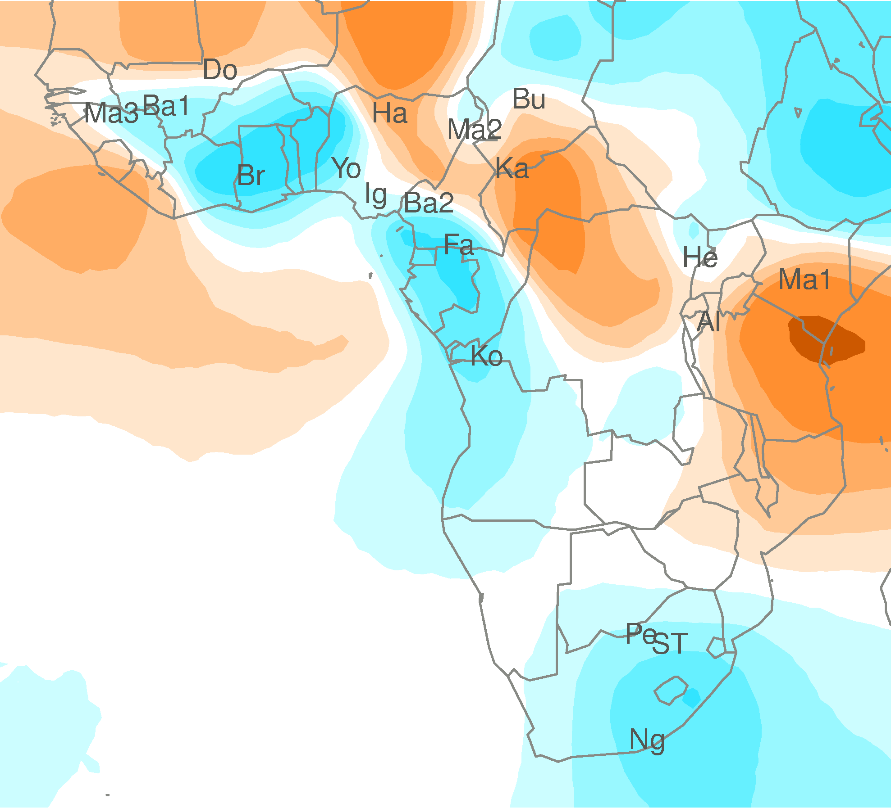

My wife sent out our Christmas letter this year. While I have mixed
feelings about this kind of letter in general, 
I am certainly very grateful that someone else took
care of this holiday chore, and that it required minimal effort on my part.
Anyway, this letter ended with a quiz.
You know the kind of thing, "Q1: Who, in the Stephens family,
started a blog this year?". It was harmless enough I thought, but probably
not something any of our friends would really spend more than a moment
on, right? So I was kind of surprised when several of our friends responded,
almost immediately, with *answers* to the quiz - many of them correct. 
(I hope they were not expecting prizes!) 

All this to say that people like quizzes and puzzles. And I have a puzzle
that has been kind of on my mind for a year or two now, and I still
don't know the answer. It's one of those puzzles where you think someone
out there must have solved this (or something similar)
before - quite possibly a long time ago.
And it struck me that maybe some of my blog readers would
enjoy trying to help answer it. Odds are that, unless you have a physics
background, the details of the puzzle
will lie outside your 
area of interest or expertise. 
But you don't need to let that stop you - just think about who,
of all your friends and aquaintances, is most likely  
to have ideas about this puzzle, and forward them the link.
And we'll put the power of the internet to the test!

Imagine you have a 2-dimensional sheet that has been created
using a patchwork of
different materials. For now you can assume what you like about the boundaries of the sheet -
for example, that it goes on forever, or that it is finite with known boundary.
(We might even make it the surface of a sphere if that would help.)
 These materials have some known
conductivity or resistance. Here I want to be deliberately
vague about what kind of conduction or resistance we are talking
about - you can choose whatever you like. For example, it could be conductivity
of heat if you like - but if something different turns out to be convenient
to achieve my goal then I am not fussy. 
Just assume that, at any given location (x,y)
in this sheet, I can tell you the resistance r(x,y) of the material at that point. If it helps,
the resistances I have in mind are piecewise constant - hence the idea of
a "patchwork" of materials. 
 
My goal is to use this resistance surface to define a **distance** between every pair of points in the sheet. This distance should of course satisfy
the usual requirements of a distance. However, it also has to 
capture the following qualitative idea: all other things being equal,
points that are separated by material of low resistance will be less distant than points that are the same physical distance apart but separated by material of high resistance.
That's it! Oh, and I'd like to be able to compute this distance between
all pairs of $n$ given points. Efficiently, and (ideally) with code that someone else has written already. 

If you have gotten this far then you may be wondering "why?".
The background to this question (and our best stab at an answer) 
can be found in 
[this preprint](http://biorxiv.org/content/early/2014/11/26/011809).
Here's the short version. We have collected data (DNA?) on
individuals (people?) living on this surface (the world?) and from
these data we can compute a distance between every pair of individuals
in data space. We want to infer a resistance surface
that would "explain" the distances we observe - that is 
such that the distance between pairs of individuals implied by 
this resistance surface
is a good match to the distances we observe in the data. For example,
if the data cluster the individuals into two clear groups, corresponding 
to two different parts of the surface, then this might be 
represented by a "barrier" of high resistance between the two groups. 

Our paper tackles this problem by making use of the idea of "resistance" distance, which is defined on a network or graph with specified resistances
on each edge - effectively we have replaced the surface in my question
with a dense grid of interconnected nodes. But it has always struck 
me that there may be alternative
(possibly preferable?) solution based on conductivity/resistance in a continuous medium, rather than in a network.
And if so, maybe it is just a matter of
finding the right person to talk to, and the right software implementation,
and it could be tried out. If you know that person, let me know!

<!------ 
